# Sunum Taslağı — Deepfake Tespit ve Görüntü Kalitesi

> Her `---` bloğu bir slayt. Görselleri `docs/assets/figures/` altından sürükle-bırak veya Marp/Slidev'e aktar.

---

## Slayt 1 — Kapak

# JPEG, Blur ve Gürültünün Deepfake Tespit Performansına Etkisi

**Sayısal Görüntü İşleme Ödevi**  
Haziran 2026

Model: Xception · Veri: FaceForensics++ c23

---

## Slayt 2 — Problem

### Neden önemli?

- Deepfake videolar hızla yayılıyor
- Tespit modelleri laboratuvar verisinde çok iyi çalışıyor
- Gerçek dünyada görüntüler: sıkıştırılmış, bulanık, gürültülü

### Araştırma sorusu

> JPEG sıkıştırması, bulanıklık ve gürültü deepfake tespit performansını nasıl etkiler?

---

## Slayt 3 — Hipotez

### Hipotez

**Görüntü kalitesi düştükçe deepfake tespit performansı (AUC) azalacaktır.**

### Beklenti

| Bozulma | Beklenen etki |
|---------|---------------|
| JPEG | Orta (sıkıştırma artefaktları) |
| Blur | Orta-yüksek (detay kaybı) |
| Noise | Yüksek (izlerin maskelenmesi) |

---

## Slayt 4 — Veri seti

| Özellik | Değer |
|---------|-------|
| Kaynak | FaceForensics++ |
| Tür | Deepfakes |
| Sıkıştırma | c23 |
| Video | 20 real + 20 fake |
| Test | 60 kare (30+30) |

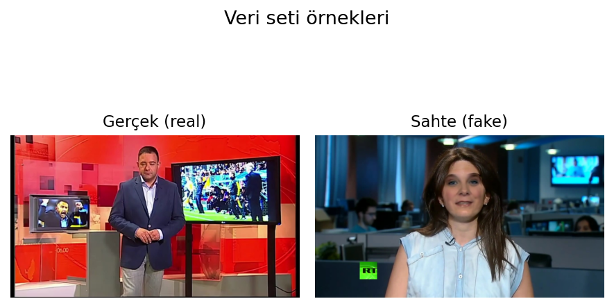

---

## Slayt 5 — Pipeline

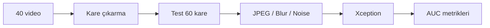

- Eğitim yapılmadı → hazır checkpoint (`full_c23.p`)
- Aynı 60 kareye tüm bozulmalar uygulandı

---

## Slayt 6 — Bozulma türleri

| Tür | Seviyeler |
|-----|-----------|
| JPEG | q = 90, 70, 50, 30, 10 |
| Gaussian Blur | k = 3, 5, 7, 11 |
| Gaussian Noise | σ = 5, 10, 20, 40 |

**Toplam:** 14 deney koşulu + baseline

---

## Slayt 7 — Bozulma örnekleri (JPEG)

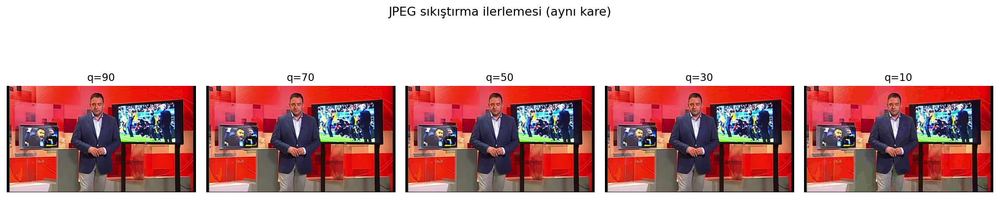

Kalite düştükçe blok artefaktları artıyor.

---

## Slayt 8 — Bozulma örnekleri (Blur)

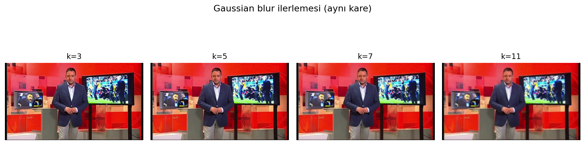

Yüz detayları ve kenarlar kayboluyor.

---

## Slayt 9 — Bozulma örnekleri (Noise)

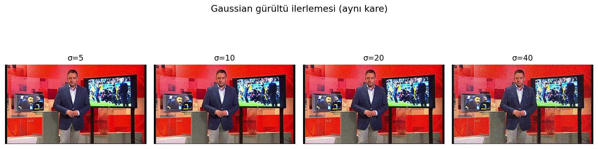

σ=40'da görüntü neredeyse tanınmaz.

---

## Slayt 10 — Baseline sonuç

### Bozulmasız test

| Accuracy | AUC | F1 |
|----------|-----|-----|
| **1.00** | **1.00** | **1.00** |

Model temiz veride mükemmel çalışıyor.

---

## Slayt 11 — JPEG sonuçları

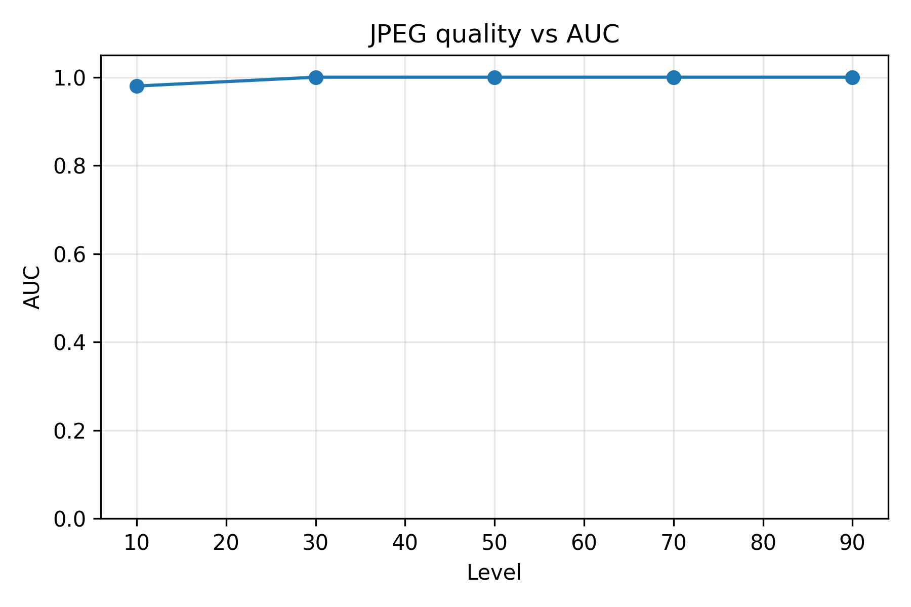

- q90–q30: AUC = 1.00 (etki yok)
- q10: AUC = **0.98** (hafif düşüş)

---

## Slayt 12 — Blur sonuçları

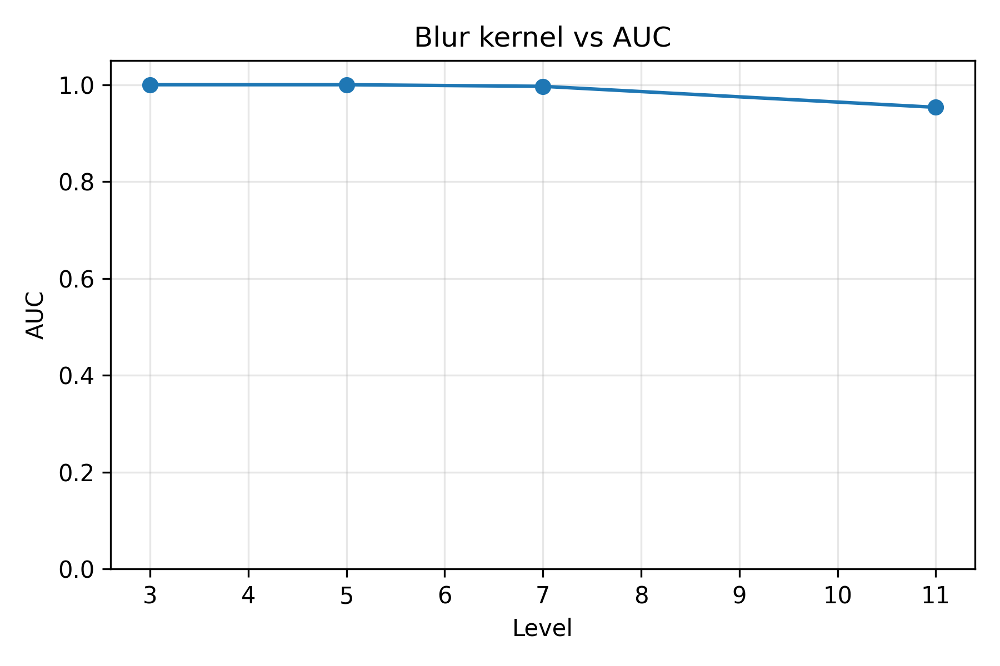

- k3: AUC = 1.00
- k11: AUC = **0.95** (monoton düşüş)

---

## Slayt 13 — Noise sonuçları

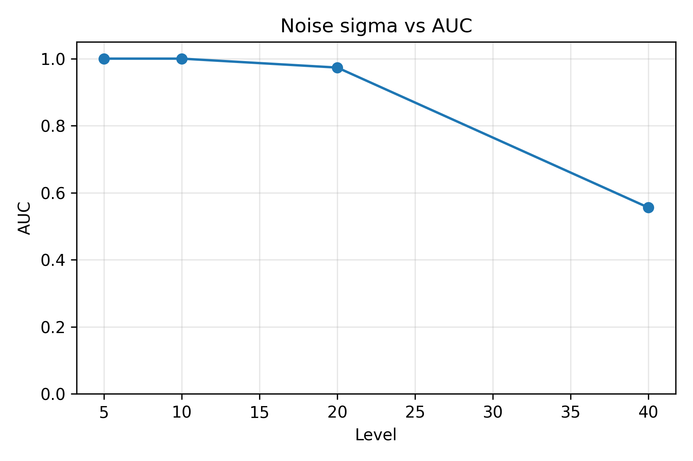

- σ5–10: AUC = 1.00
- σ20: AUC = 0.97
- σ40: AUC = **0.56** ← kritik düşüş

---

## Slayt 14 — En kötü senaryolar

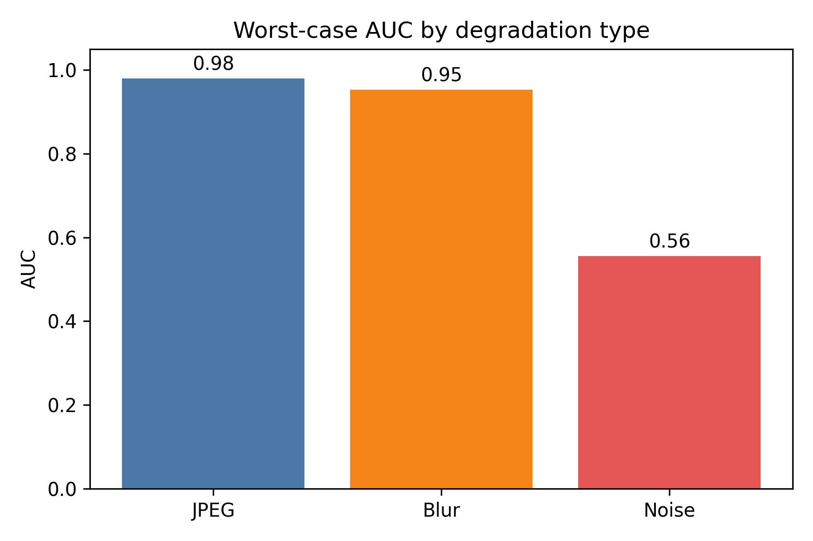

| Koşul | AUC | Δ (baseline) |
|-------|-----|--------------|
| JPEG q10 | 0.98 | −0.02 |
| Blur k11 | 0.95 | −0.05 |
| **Noise σ40** | **0.56** | **−0.44** |

**En zararlı bozulma: Gaussian gürültü**

---

## Slayt 15 — Noise σ40: neden bu kadar kötü?

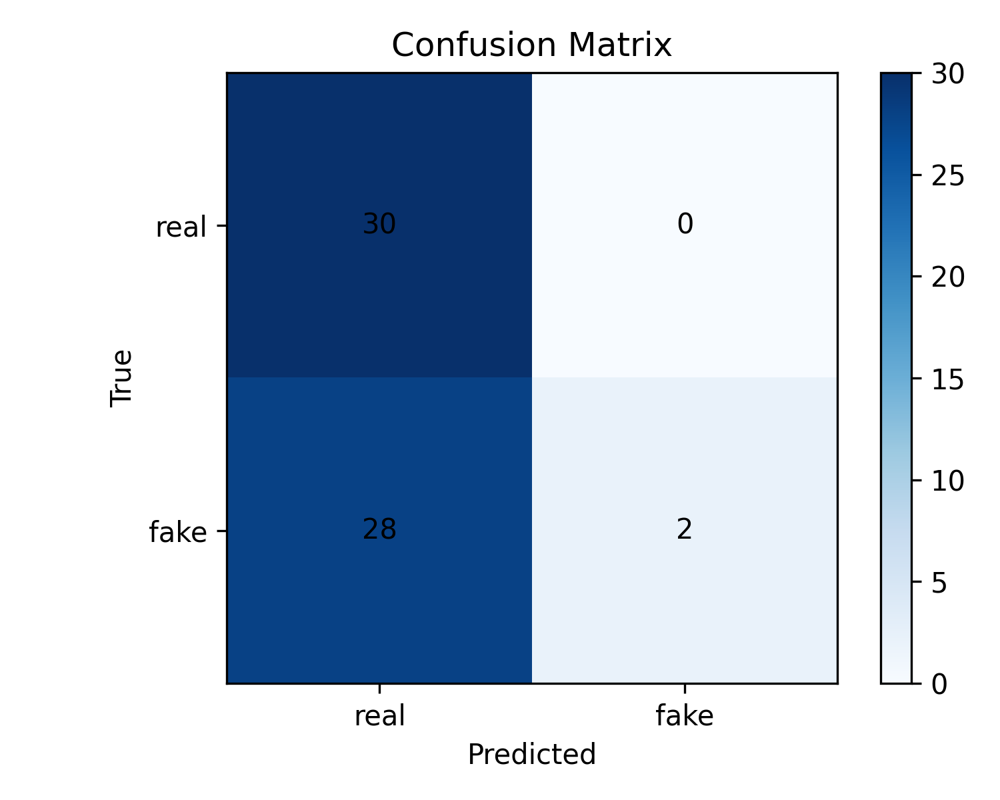

- Accuracy: %53 (neredeyse rastgele)
- Sahte karelerin %93'ü "gerçek" sanılıyor
- Gürültü, deepfake artefaktlarını maskeliyor

---

## Slayt 16 — Literatür karşılaştırması

| Yöntem | FF++ | Metrik | Skor |
|--------|------|--------|------|
| MesoNet | c23 | Acc | 83.1% |
| Xception | c23 | Acc | 95.7% |
| EfficientNet-B4 | c23 | AUC | 95.6% |
| **Bizim baseline** | subset | AUC | 1.00 |
| **Bizim noise σ40** | subset | AUC | **0.56** |

Literatür temiz veride yüksek; bizim katkı = **ek bozulma altında düşüş**

---

## Slayt 17 — Sonuç

### Hipotez: ✅ Desteklendi

1. Kalite düştükçe performans azaldı
2. En büyük etki: **gürültü** (AUC 1.00 → 0.56)
3. JPEG ve blur daha dayanıklı

### Tek cümle

> Laboratuvar koşullarında mükemmel çalışan Xception, gerçek dünya benzeri gürültü altında neredeyse işlevsiz hale geliyor.

---

## Slayt 18 — Teşekkürler / Sorular

### Kaynaklar

- Rössler et al., FaceForensics++, ICCV 2019
- Chollet, Xception, CVPR 2017

### Görseller

`docs/assets/figures/`

**Sorular?**

---

## Ek slaytlar (isteğe bağlı)

### Tüm confusion matrix'ler — JPEG

| q90 | q70 | q50 |
|-----|-----|-----|
| 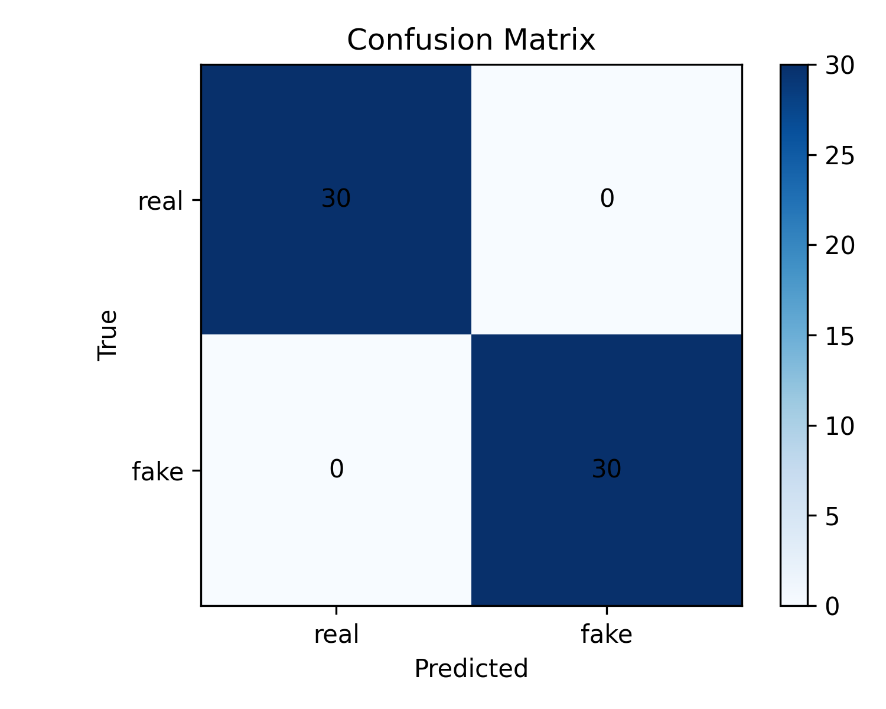 |  |  |

| q30 | q10 |
|-----|-----|
|  | 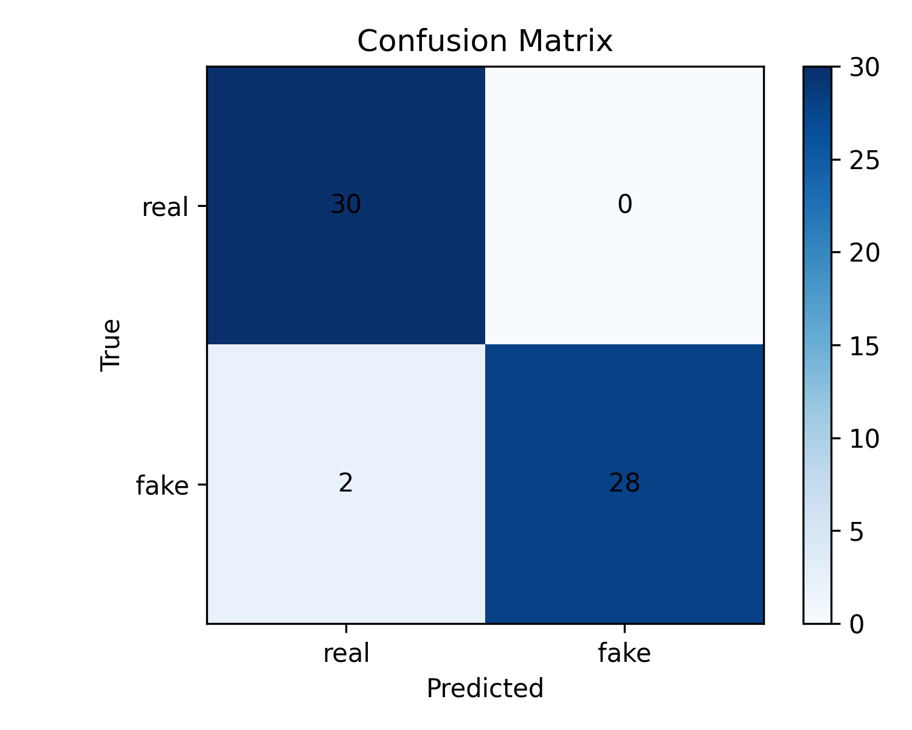 |

### Tüm confusion matrix'ler — Blur & Noise

| k3 | k5 | k7 | k11 |
|----|----|----|-----|
|  | 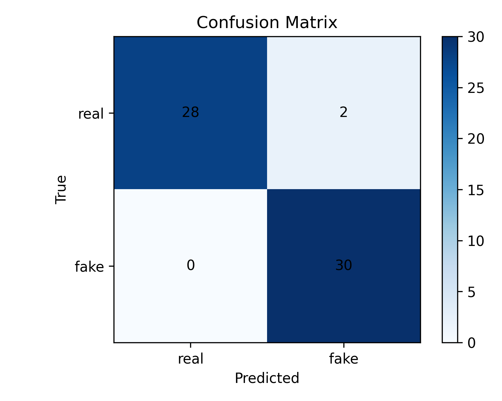 | 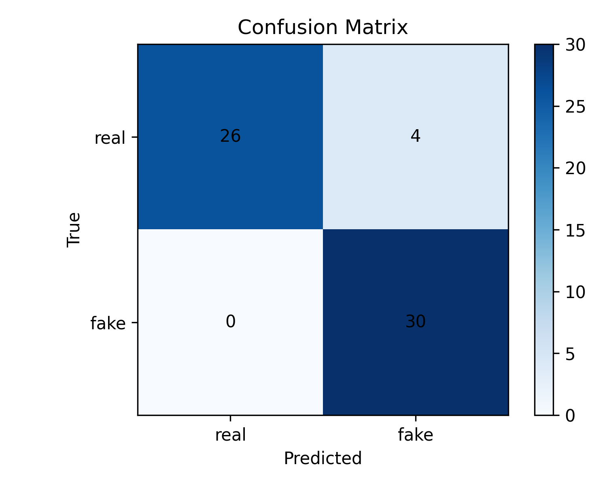 | 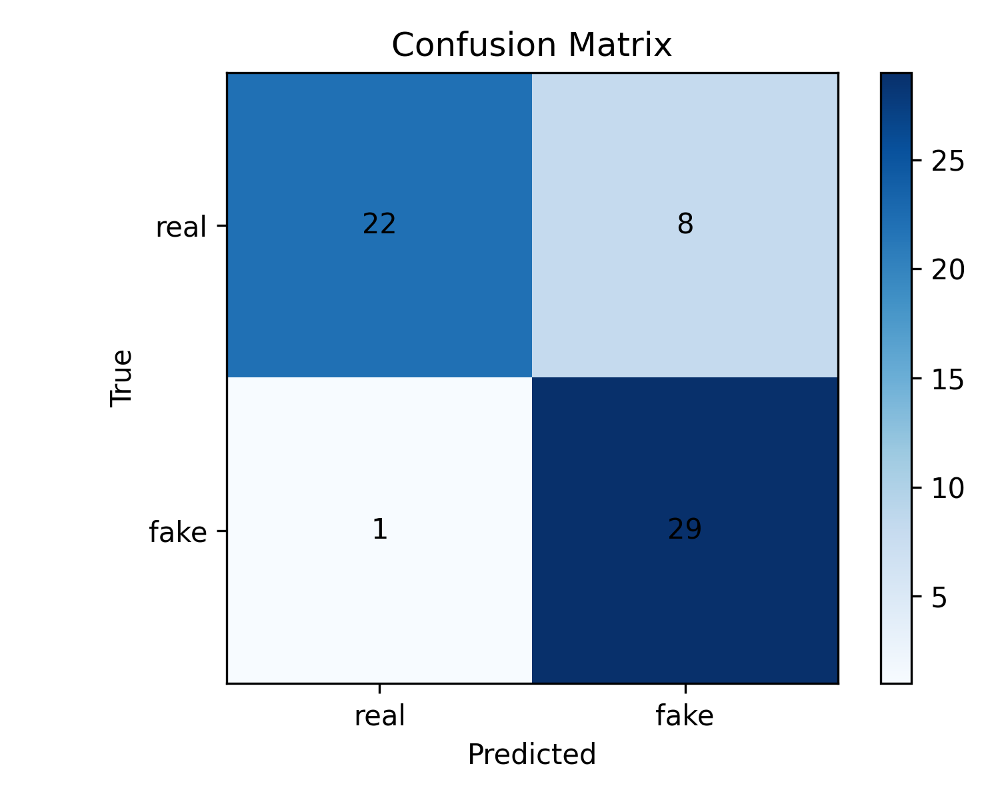 |

| σ5 | σ10 | σ20 | σ40 |
|----|-----|-----|-----|
|  |  | 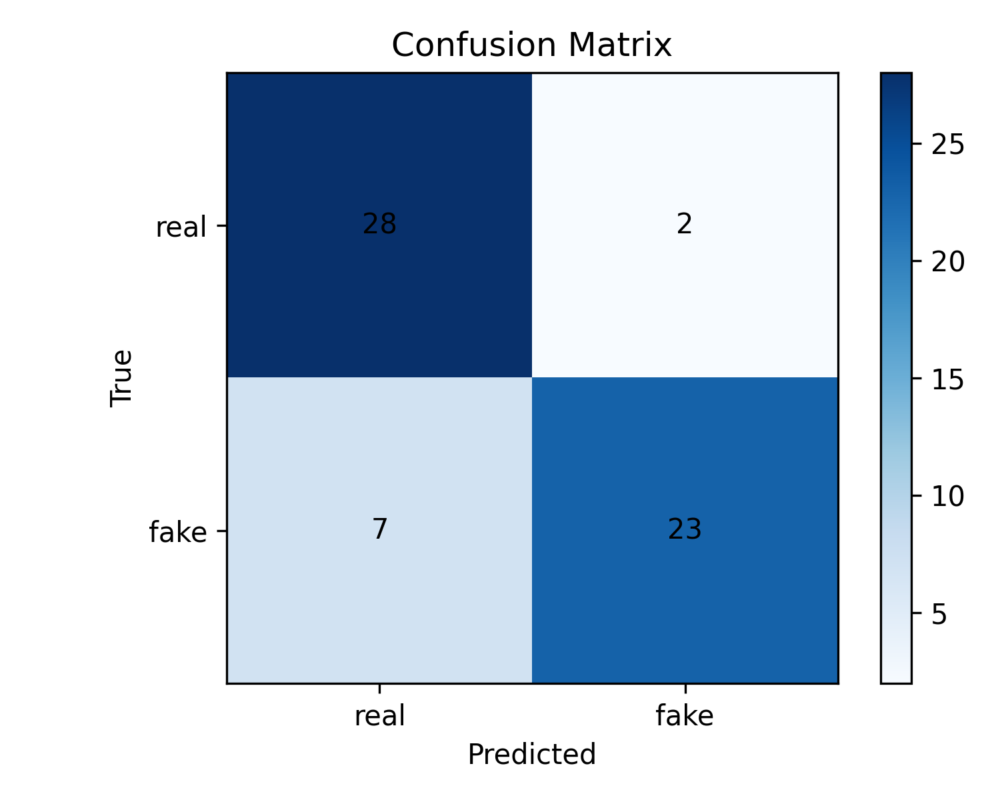 |  |
